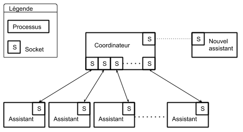
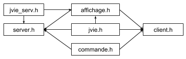

Jeu de la vie clients/serveur
=============================

Le but de ce programme est d'illustratrer le modèle d'interaction entre processus "Bag of Distributed Tasks" avec l'automate cellulaire du jeu de la vie.

Introduction
------------

### Distributed Bag of Tasks

Au cour de ce projet nous allons illustrer le modèle de programmation __Distributed Bag of Tasks__. Faisons tout d'abord un rappel sur les différents types de programmes concurrents :
* Programme multi-contexte (__multi-threaded__) = contient plusieurs __threads__ pour mieux organiser et structurer une application.
* Programme parallèle = chaque processus s’exécute sur son propre processeur.
* Programme distribué = les processus communiquent entre eux par l'intermédiaire d'un réseau.

A ces types s'ajoutent différent modèles pour diviser une tâche. Avec la décomposition du style "__sac de tâches__", plutôt que de fixer le nombre de processus, on fixe une taille désirée pour chacune des tâches. On les répartis ensuite entre les divers processus disponibles.
Lorsqu'on utilise cette stratégie, on crée un certains nombre de processus (nombre qui peut être déterminé par la structure de la machine, c'est à dire par le nombre de processeurs). On crée aussi, de façon indépendante, un certain nombre de tâches (plus précisément, de __descripteurs de tâches__), tâches qu'on insère dans une structure de données appropriée, appelée __sac de tâches__ (en anglais, __bag of Tasks__, parfois appelé __Task Pool__).
Lorsqu'un processus ou processeur devient libre, il choisit alors une des tâches disponibles dans le sac et l’exécute. Dans certains cas, l'exécution d'une telle tâche génère alors de nouvelles tâches, lesquelles sont simplement ajoutées au sac. Le programme dans son ensemble se termine lorsqu'il ne reste plus __aucune__ tâches à exécuter, c'est à dire lorsque le sac des tâches est vide.

Dans ce projet, nous allons associer un type de programmation __distribué__ à un modèle __sac de tâches__ avec comme patron de base __clients-serveur__.

### Jeu de la vie

Le jeu de la vie est un automate cellulaire. Ce jeu sans joueur a été imaginé par John Horton Conway en 1970. C'est probablement à l'heure actuelle le plus connu des automates cellulaires.
Le jeu se déroule sur une grille à deux dimensions, théoriquement infinie (mais de longueur et de largeur finies et plus ou moins grandes dans la pratique), dont les cases — qu’on appelle des "cellules", par analogie avec les cellules vivantes — peuvent prendre deux états distincts : "vivantes" ou "mortes".
À chaque étape, l’évolution d’une cellule est entièrement déterminée par l’état de ses huit voisines de la façon suivante :
* Une cellule morte possédant exactement trois voisines vivantes devient vivante (elle naît).
* Une cellule vivante possédant deux ou trois voisines vivantes le reste, sinon elle meurt.

### Cahier des charges

Le projet consiste à développer un jeu de la vie de manière distribué, avec un coordinateur et des processus assistants. Le processus coordinateur doit gérer une grille et la répartir en tâches qu'il confiras à ses processus assistants en utilisant le modèle __Bag of Tasks__.
Le processus coordinateur doit initialiser le jeux en lisant un fichier __fic-init__ qui définit les paramètres suivants :
* n : la dimension de la grille nXn ( n=16)
* b : la taille en cellules d'un bloc (b=4)
* p : le nombre de processus-assistant (p=16)
* la liste des cellules vivantes initiales de la grille, précisées par leurs coordonnées.
A chaque itération l’ensemble des processus disponibles (coordinateur et assistants) recalcule les valeurs des différentes cellules à l'aide de canal de communications.
Un processus aléatoire permet d'injecter de la vie dans l'espace par génération spontanée d'organisme dans une cellule choisie au hasard : s’il s'agit d'une cellule morte, alors elle devient vivante et contient l'organisme nouvellement créé; s’il s'agit d'une cellule vivante, elle devient morte car deux organismes ne peuvent pas partager la même cellule.
Un autre processus aléatoire d’épidémie virale peut se réveiller et à partir d’une cellule c(x, y) tuer toutes cellules (c(x+1, y+1), c(x+2, y+2), c(x+3, y+3) etc. ) situées sur diagonale issue de la cellule c(x,y).

Structure logique
-----------------

### Architecture générale

Nous avons un processus coordinateur et __i__ processus assistants. Le processus coordinateur se charge de gérer les communications avec les processus assistants et de leurs assigner des tâches. Chaque processus communique avec un autre via des __sockets__.
Le processus coordinateur dispose d'un __socket__ pour traiter l'arrivée de nouveaux clients et d'un tableau de __i sockets__ pour communiquer avec les assistant déjà connu (__sélecteur de socket__).

Lorsqu'un processus assistant est crée, il communique avec le coordinateur via un __socket nommé__. Si le nombre maximum d'assistants n'est pas atteint, le coordinateur crée un nouveau __socket__ spécifique pour cet assistant et le range dans un tableau pour le retrouver facilement.

### Structures de données

Pour une meilleure organisation, nous avons séparé notre projet en fichiers, un récapitulatif des inclusions est donnée ci-dessous.

