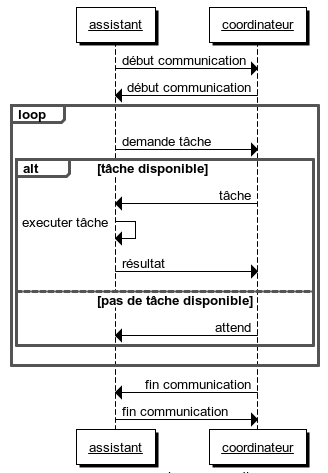
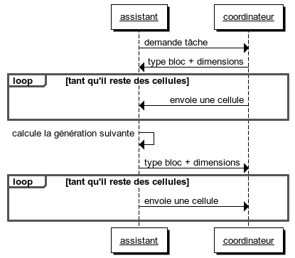
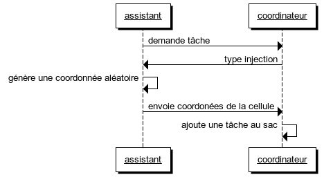
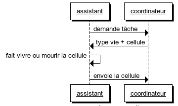
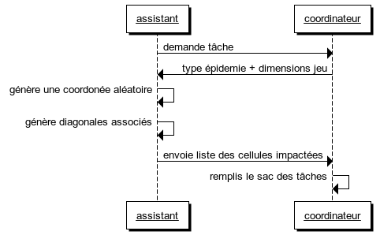
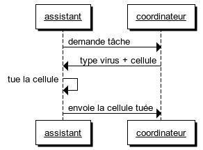
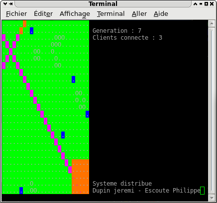
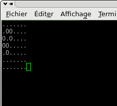

Jeu de la vie clients/serveur
=============================

Le but de ce programme est d'illustratrer le modèle d'interaction entre processus "Bag of Distributed Tasks" avec l'automate cellulaire du jeu de la vie.

Introduction
------------

### Distributed Bag of Tasks

Au cour de ce projet nous allons illustrer le modèle de programmation _Distributed Bag of Tasks_. Faisons tout d'abord un rappel sur les différents types de programmes concurrents :
* Programme multi-contexte (_multi-threaded_) = contient plusieurs _threads_ pour mieux organiser et structurer une application.
* Programme parallèle = chaque processus s’exécute sur son propre processeur.
* Programme distribué = les processus communiquent entre eux par l'intermédiaire d'un réseau.

A ces types s'ajoutent différent modèles pour diviser une tâche. Avec la décomposition du style "_sac de tâches_", plutôt que de fixer le nombre de processus, on fixe une taille désirée pour chacune des tâches. On les répartis ensuite entre les divers processus disponibles.
Lorsqu'on utilise cette stratégie, on crée un certains nombre de processus (nombre qui peut être déterminé par la structure de la machine, c'est à dire par le nombre de processeurs). On crée aussi, de façon indépendante, un certain nombre de tâches (plus précisément, de _descripteurs de tâches_), tâches qu'on insère dans une structure de données appropriée, appelée _sac de tâches_ (en anglais, _bag of Tasks_, parfois appelé _Task Pool_).
Lorsqu'un processus ou processeur devient libre, il choisit alors une des tâches disponibles dans le sac et l’exécute. Dans certains cas, l'exécution d'une telle tâche génère alors de nouvelles tâches, lesquelles sont simplement ajoutées au sac. Le programme dans son ensemble se termine lorsqu'il ne reste plus _aucune_ tâches à exécuter, c'est à dire lorsque le sac des tâches est vide.

Dans ce projet, nous allons associer un type de programmation _distribué_ à un modèle _sac de tâches_ avec comme patron de base _clients-serveur_.

### Jeu de la vie

Le jeu de la vie est un automate cellulaire. Ce jeu sans joueur a été imaginé par John Horton Conway en 1970. C'est probablement à l'heure actuelle le plus connu des automates cellulaires.
Le jeu se déroule sur une grille à deux dimensions, théoriquement infinie (mais de longueur et de largeur finies et plus ou moins grandes dans la pratique), dont les cases — qu’on appelle des "cellules", par analogie avec les cellules vivantes — peuvent prendre deux états distincts : "vivantes" ou "mortes".
À chaque étape, l’évolution d’une cellule est entièrement déterminée par l’état de ses huit voisines de la façon suivante :
* Une cellule morte possédant exactement trois voisines vivantes devient vivante (elle naît).
* Une cellule vivante possédant deux ou trois voisines vivantes le reste, sinon elle meurt.

### Cahier des charges

Le projet consiste à développer un jeu de la vie de manière distribué, avec un coordinateur et des processus assistants. Le processus coordinateur doit gérer une grille et la répartir en tâches qu'il confiras à ses processus assistants en utilisant le modèle _Bag of Tasks_.
Le processus coordinateur doit initialiser le jeux en lisant un fichier _fic-init_ qui définit les paramètres suivants :
* n : la dimension de la grille nXn ( n=16)
* b : la taille en cellules d'un bloc (b=4)
* p : le nombre de processus-assistant (p=16)
* la liste des cellules vivantes initiales de la grille, précisées par leurs coordonnées.

A chaque itération l’ensemble des processus disponibles (coordinateur et assistants) recalcule les valeurs des différentes cellules à l'aide de canal de communications.
Un processus aléatoire permet d'injecter de la vie dans l'espace par génération spontanée d'organisme dans une cellule choisie au hasard : s’il s'agit d'une cellule morte, alors elle devient vivante et contient l'organisme nouvellement créé; s’il s'agit d'une cellule vivante, elle devient morte car deux organismes ne peuvent pas partager la même cellule.
Un autre processus aléatoire d’épidémie virale peut se réveiller et à partir d’une cellule c(x, y) tuer toutes cellules (c(x+1, y+1), c(x+2, y+2), c(x+3, y+3) etc. ) situées sur diagonale issue de la cellule c(x,y).

Structure logique
-----------------

### Architecture générale

Nous avons un processus coordinateur et _i_ processus assistants. Le processus coordinateur se charge de gérer les communications avec les processus assistants et de leurs assigner des tâches. Chaque processus communique avec un autre via des _sockets_.
Le processus coordinateur dispose d'un _socket_ pour traiter l'arrivée de nouveaux clients et d'un tableau de _i sockets_ pour communiquer avec les assistant déjà connu (_sélecteur de socket_).

Lorsqu'un processus assistant est crée, il communique avec le coordinateur via un _socket nommé_. Si le nombre maximum d'assistants n'est pas atteint, le coordinateur crée un nouveau _socket_ spécifique pour cet assistant et le range dans un tableau pour le retrouver facilement.

### Structures de données

Pour une meilleure organisation, nous avons séparé notre projet en fichiers, un récapitulatif des inclusions est donnée ci-dessous.

#### jvie.h

Ce fichier gère tout ce qui est en rapport avec le jeu de la vie, on y trouve une structure importante : le plateau de jeu.

`
typedef struct {
    int width;
    int height;
    char** grille;
} plateau;
`

Utilisé aussi bien par le coordinateur que les assistants, il intègre deux entiers _width_ et _height_ pour définir les dimensions du plateau. On retrouve également un tableau à deux dimensions de type _char_. Une cellule peut être soit vivante soit morte, le type booléen n'existant pas dans le langage C, nous avons choisi le type _char_ car il occupe moins d'espace mémoire qu'un entier. Il occuperas également moins de bande passante pour le réseau.

#### jvie\_serv.h

Utilisé principalement par le coordinateur, ce fichier permet de gérer les blocs de données attribués aux assistants. Il s'agit du _sac de tâches_.

`
typedef int SOCKET;

typedef enum {
    A_TRAITER_V = 0,
    A_TRAITER_H = 1,
    A_TRAITER = 2,
    EN_TRAITEMENT_V = 3,
    EN_TRAITEMENT_H = 4,
    EN_TRAITEMENT = 5,
    TRAITEE_V = 6,
    TRAITEE_H = 7,
    TRAITEE = 8
} c_stat;

typedef enum
{
    VIRUS = 0,
    HEAL = 1,
    NORMAL = 2
} type;

typedef struct {
    c_stat statut;
    SOCKET client;
} cellstat;

typedef struct {
    int width;
    int height;
    int generation;
    cellstat** grille;
} PlateaStatut;

typedef struct {
    type t;
    int x;
    int y;
    int width;
    int height;
} Block;
`

Une énumération permet, pour une cellule, de savoir si elle attend d'être traité, si elle est en cours de traitement,si son traitement est terminé ou si elle est impacté par un virus ou une naissance. La structure _cellstat_ permet d'associer cet état à un client lorsqu'elle est en cour de traitement.

La structure _PlateauStatut_ représente le statut de chaque cellules du jeu, les attributs _width_ et _height_ doivent donc être identiques à ceux du jeu pour que l'attribut _grille_ corresponde a celui-ci. L'attribut _generation_ permet d'identifier la génération courante et ainsi d'éviter la réception de données erronées (venant d'un calcul ancien par exemple).

On ne traite en général pas une seule cellule à la fois, une dernière structure permet donc de représenter des blocs de cellules attribués par le coordinateur aux assistants.

#### client.h

Le client ne contient pas de structure particulière, il se sert du fichier _jvie.h_ pour les calculs et du fichier _commande.h_ pour communiquer. Il dispose cependant d'états pour connaître son statut par rapport à son dialogue avec le serveur.

`
typedef enum {
    DEMANDE,
    ENVOYE,
    RECU,
    REFU
} etat_c;
`

Ces différents états permettent de savoir si un calcul a été demandé, si il a été envoyé (donc calculé), si un nouveau calcul à été reçu ou bien si un refus du serveur pour quelconque raison a été reçu.

#### server.h

Le serveur doit à la fois gérer le plateau principal du jeu, le sac de taches et les clients. Pour les deux premiers, il inclus les fichiers _jvie.h_ et _jvieserv.h_. Pour gérer les clients il dispose d'un structure.

`
typedef struct {
    SOCKET sock;
    int generation;
    int x;
    int y
    int width;
    int height;
} Client;
`

Le serveur range les clients dans un tableau. L'attribut _sock_ est un _socket_ qui permet de communiquer avec le client. L'attribut _generation_ permet de vérifier que le client n’envoie pas de données obsolètes. Le reste des attribut sont présent pour placer le résultat reçus au bon endroit dans le plateau de jeu.

Communications, synchronisation et échange de données
-----------------------------------------------------

### Échanges nécessaires

Nous allons présenter dans cette section les échanges nécessaire pour une bonne communication entre le coordinateur et les assistants. La figure ci-dessous résume un échange type.

Lorsque le coordinateur est lancé, il attend qu'un assistant se connecte à lui. Il attend donc un message de type _début communication_ qu'il peut renvoyer à l'assistant pour confirmation. A ce moment, l'assistant peut commencer à demander des taches. Deux options possibles pour le coordinateur :
* Des taches sont disponibles, le coordinateur envoi donc une tache à exécuter, l'assistant exécute cette tache puis la renvoie au coordinateur.
* Il n'y a plus de taches disponibles, le coordinateur envoi un ordre d'attente à l'assistant.

Une fois ce bloc exécuté, l'assistant redemande une nouvelle tache au coordinateur etc...
A tout moment le coordinateur peut mettre fin au communications en envoyant un ordre _fin communication_.

Il existe plusieurs types de taches, chacune d'entres elle nécessite des communications supplémentaires.

#### Bloc de cellules

Cette partie correspond au cas ou la tâche correspond au calcul d'un bloc de cellules pour connaître sa génération suivante.

Quand un assistant demande une tâche, le coordinateur lui répond le plus fréquemment de calculer la génération suivante d'un bloc de cellules. Il envoi donc que le type de commande est un bloc de cellules ainsi que la taille du block. Il envoi ensuite les cellules unes par unes. Une fois les cellules réceptionnées, l'assistant calcule la génération suivante du bloc et le renvoi de la même manière au coordinateur.

#### Injection de vie

Il arrive parfois que le coordinateur envoi une commande d'injection de vie pour modifier la population. Cette commande apparaît de manière aléatoire.

Après que l'assistant ai demandé une tâche, le coordinateur lui répond que c'est une commande de type _injection_ avec les dimensions du plateau de jeu. L'assistant connaissant désormais la taille du plateau va générer une coordonnée aléatoire et l'envoyer au coordinateur pour qu'il ajoute une tache à son sac. C'est une commande spéciale car, au lieu de retirer une tache du sac, elle en ajoute une. A la fin du traitement des générations suivantes, le coordinateur demanderas de calculer les tâches restantes, celle de l'injection de vie.

L'assistant reçois une cellule. Si cette cellule est morte, l'assistant va faire vivre la cellule, dans le cas contraire il la fait mourir. Il renvoi enfin cette cellule pour finir son traitement.

#### Épidémie virale

Au même titre que l'injection de vie, le coordinateur peut demander une épidémie virale. Cette commande apparaît également de manière aléatoire.

Cette commande remplis également le sac des tâches.
L'assistant demande une tâche, le coordinateur lui répond que c'est de type _épidémie_ et lui envoi les dimensions du plateau de jeu. L'assistant génère alors une coordonnée aléatoire ainsi que la liste des cellules impactées par l'épidémie. Il envoi cette liste au coordinateur avec laquelle il va créer de nouvelles taches, une pour chaque cellule impacté.

Une fois la générations suivante du plateau de jeu effectué, le coordinateur va pouvoir envoyer de nouvelles taches pour tuer les cellules impactées par l'épidémie.

Le coordinateur envoie une commande de type _virus_ et la cellule associé. L'assistant n'a qu'a tuer la cellule et la renvoyer pour terminer son traitement.

### Trames et format de donnée

Le fichier _commande.h_ permet de communiquer avec le coordinateur et les assistants. Ce fichier définit toutes les requêtes de communications.

`
typedef enum {
    CMD_START_COMMUNICATION = 1,
    CMD_REQUEST_TASK = 2,
    CMD_NO_TASK = 3,
    CMD_TASK = 4,
    CMD_END_COMMUNICATION = 5,
    CMD_LIST_CELL = 6,
    CMD_HEAL = 7,
    CMD_VIRUS = 8
} CommandType;

typedef struct {
    int width;
    int height;
} CmdHeal;

typedef struct {
    int width;
    int height;
} CmdVirus;

typedef struct {
    int x;
    int y;
    char cell;
} coord;

typedef struct {
    long iteration;
} CmdStartCommunication;

typedef struct {
} CmdRequestTask;

typedef struct {
    long waitingTime;
} CmdNoTask;

typedef struct {
    int width;
    int height;
    char* cells;
} CmdTask;

typedef struct {
} CmdEndCommunication;

typedef struct {
    CommandType type;
    union {
	CmdStartCommunication startCom;
	CmdRequestTask request;
	CmdNoTask noTask;
	CmdTask task;
	CmdEndCommunication endCom;
	CmdListCell listCell;
	CmdHeal heal;
	CmdVirus virus;
    };
} Command;
`

Observons tout d'abord la structure _Command_, c'est elle qui sert de "squelette" pour la communication de chaque taches ou commandes. Le premier attribut permet de définir le type de commande que l'on envoi ou que l'on reçois, ce type est lui même définit par une énumération _CommandType_. En fonction du type de la commande, on peut lire ou écrire dans l'un des champs de l'_union_ correspondant.
* __CmdRequestTask__ : un assistant demande une tache au coordinateur.
* __CmdTask__ : lorsque le coordinateur envoi un bloc à traiter à un assistant ou que l'assistant envoi le résultat au coordinateur.
* __CmdNoTask__ : quand le coordinateur n'a plus de tache disponible, il envoi un temps d'attente aux assistants.
* __CmdEndCommunication__ : met fin au communications.
* __CmdListCell__ : Liste de coordonées de cellules. Est utilisé par les assistants pour remettre des taches dans le sac du coordinateur, soit en tant que virus, soit en tant que cellule a faire vivre.
* __CmdHeal__ : ordre de faire naitre une cellule aléatoirement.
* __CmdVirus__ : ordre de générer un virus.

Guide utilisateur
-----------------
Il y a trois commandes à connaître :
* __server__ : Lance le serveur, un seul serveur par machine doit être lancé, sinon il faut changer le port d'écoute.
* __client 127.0.0.1__ : Lance un client, on peut en lancer autant que l'on veux. L'option __quiet__ permet de désactiver l'affichage. On peut remplacer l'ip pour communiquer avec un serveur distant.
* __clients.sh N__ : Script qui lance N clients en tache de fond.

### Serveur

Lorsque le serveur est lancé et que des clients se sont connecté, on peut observer l'avancement de son travail. 
Une cellule morte est représenté par "." et une cellule vivante "O".
Les blocs orange sont les blocs en cour de traitement et les blocs verts sont les blocs traité. Les cellules violettes sont les cellules impactés par un virus et les cellules bleues sont naissantes.

On peut vérifier à tout moment la génération actuelle et le nombre de clients connecté.

### Client

Beaucoup plus simple, le client affiche le bloc qu'il calcule.

Conclusion
----------

Nous avons un serveur qui communique avec _n_ clients. Le serveur génère les taches (sac de taches) et les envois aux clients. Les clients vident le sac en les exécutant et parfois le remplisse lorsque la tache l'impose (ex. virus).

Les clients ne peuvent pas communiquer entre eux. Le serveur doit donc envoyer les bordures avec le bloc de cellule pour que le calcul du client soit correct.

Le serveur est un unique processus qui gère la connexion des clients et le sac des taches. Cependant nous avons implémenté un sélecteur de socket pour une exécution rapide.

Les clients auraient pu communiquer entre eux pour connaitre les bordures du bloc a traiter. mais cela implique qu'il y ai un nombre minimum de clients qui s’exécutent en même temps. Cependant, l'exécution serait probablement plus rapide.

Le serveur aurai pu avoir un processus par client. Le rangement des résultats dans le plateau du jeu de la vie aurai été plus rapide.
